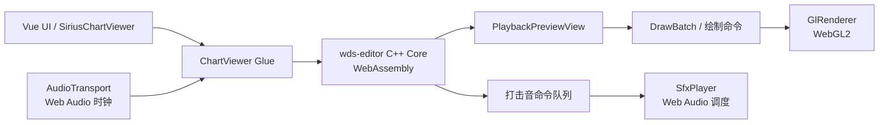

# Sirius Chart Viewer

<p align="center">
  
</p>

<p align="center">
  基于 <a href="https://github.com/TeamOpenSirius/wds-editor">wds-editor</a> 预览内核的
  <em>World Dai Star</em> 网页 3D 谱面预览器。
</p>

<p align="center">
  <a href="./README.md">English</a> ·
  <a href="./README-CN.md"><strong>简体中文</strong></a>
</p>

<p align="center">
  <a href="https://github.com/TeamOpenSirius/SiriusChartViewer/actions/workflows/build.yml"></a>
  
  
  
  
</p>

---

## 项目简介

**Sirius Chart Viewer** 将 `wds-editor` 的谱面预览能力移植到了浏览器。

项目没有在 JavaScript 中重新实现整套谱面渲染逻辑，而是直接复用上游编辑器的 C++ 预览核心，通过 **Emscripten** 编译为 **WebAssembly**，并使用 **WebGL2** 实现浏览器端渲染。播放时序和打击音调度基于 **Web Audio API**，独立页面与可嵌入组件则使用 **Vue 3 + TypeScript** 开发。

项目目标是尽可能保持网页版预览和桌面端 `wds-editor` 预览区在画面、判定效果、分割线、Combo 与打击音时序上的一致，同时让它能够直接部署为静态网页，或嵌入其他 Web 项目。

> 本项目仅提供**谱面预览功能**，不包含谱面编辑功能。

## 主要特性

- 无需安装桌面客户端，直接在浏览器中预览谱面。
- 通过 Git submodule **直接复用 `wds-editor` C++ 预览核心**。
- 支持：
  - `.wdschart`
  - 官方 `.csv`
  - `.sus`
- 可同时加载音乐、曲绘和官方 `music_config.csv`。
- 尽可能保持与桌面编辑器一致的：
  - 舞台和 Note 绘制；
  - 分割线与特效；
  - Combo 显示；
  - 判定文字；
  - 打击音触发时序。
- 使用 Web Audio 作为音乐播放时钟，并精确调度打击音。
- 支持 **0.5× ～ 2×** 播放速度。
- 可调整：
  - 流速；
  - 挡板 / Note 起始偏移；
  - Note 厚度；
  - 分割线特效透明度；
  - 音乐音量；
  - 打击音量；
  - 长按持续音开关；
  - 判定文字。
- 支持进度拖动、快捷键、全屏和移动端自适应。
- 同时提供：
  - **独立网页版本**；
  - **可嵌入 Vue 组件版本**。
- 支持通过 URL 参数直接加载远程谱面和资源。

## 支持的输入

| 类型 | 支持格式 / 行为 |
| --- | --- |
| 谱面 | `.wdschart`、官方 `.csv`、`.sus` |
| 音乐 | OGG、MP3、WAV、M4A/AAC、FLAC、Opus、WebM 等浏览器可解码格式 |
| 曲绘 | PNG、JPEG、WebP、GIF、AVIF、BMP 等浏览器可解码图片 |
| 音乐配置 | 官方 `music_config.csv`，读取 `DelaySeconds` |

实际音频和图片格式支持范围最终取决于浏览器自身的解码能力。

## 技术栈

| 层级 | 技术 |
| --- | --- |
| 前端 UI | Vue 3、TypeScript |
| Web 构建 | Vite |
| 谱面预览核心 | `wds-editor` 的 C++17 代码 |
| Native → Web | Emscripten + CMake |
| 图形渲染 | WebGL2 |
| 音乐与时序 | Web Audio API |
| 持续集成 | GitHub Actions |

## 快速开始

### 环境要求

- **Node.js 20+**
- **Emscripten / emsdk**
- **CMake 3.20+**
- 推荐安装 **Ninja**

克隆仓库时需要同时拉取 submodule：

```bash
git clone --recursive https://github.com/TeamOpenSirius/SiriusChartViewer.git
cd SiriusChartViewer

npm ci
npm run dev
```

如果已经 clone 过仓库，但没有拉取 submodule：

```bash
git submodule update --init --recursive
```

`npm run dev` 会依次完成：

1. 从 `wds-editor` 同步打击音资源；
2. 将 C++ 预览核心编译为 WebAssembly；
3. 启动 Vite 开发服务器。

### Emscripten 查找顺序

`scripts/build-wasm.mjs` 会按以下顺序寻找 Emscripten：

1. `EMSDK` 环境变量；
2. `PATH` 中的 `emcc`；
3. Windows 下的 `C:/SDK/emsc/emsdk`。

需要生成带详细 `WDS_LOG` 输出的 Debug WASM 时：

```bash
node scripts/build-wasm.mjs --debug
```

Debug 构建目录为：

```text
build/wasm-debug/
```

## NPM Scripts

| 命令 | 说明 |
| --- | --- |
| `npm run dev` | 同步资源、编译 WASM，然后启动 Vite |
| `npm run build` | 构建独立网页到 `dist/` |
| `npm run preview` | 本地预览生产构建 |
| `npm run typecheck` | 执行 Vue / TypeScript 类型检查 |
| `npm run sync:assets` | 从 submodule 同步运行时打击音 |
| `npm run build:wasm` | 将 C++ 预览核心编译到 `public/wasm/` |
| `npm run build:lib` | 构建可嵌入组件到 `dist-lib/` |

独立网页构建使用相对路径，因此 `dist/` 可以部署到站点的任意子路径中。

## 独立网页使用方式

可以直接把文件拖入页面，也可以点击“打开文件”并一次选择多个相关文件。

例如：

```text
expert.csv
song.mp3
cover.jpg
music_config.csv
```

页面会自动区分谱面、音乐、曲绘和配置文件。

### 快捷键

| 按键 | 功能 |
| --- | --- |
| `Space` | 播放 / 暂停 |
| `←` / `→` | 后退 / 前进 5 秒 |
| `Shift + ←` / `Shift + →` | 后退 / 前进 1 秒 |
| `Home` | 回到谱面起始位置 |
| `F` | 切换全屏 |
| 双击画面 | 切换全屏 |

在 iOS Safari 等不支持元素级 Fullscreen API 的环境中，组件会退化为铺满整个视口。

### URL 参数

独立页面支持直接通过 URL 加载远程资源：

```text
index.html?chart=<谱面URL>&music=<音乐URL>&cover=<曲绘URL>&config=<music_config URL>&name=<显示名>&t=<起始秒>
```

| 参数 | 说明 |
| --- | --- |
| `chart` | 谱面 URL |
| `music` | 可选，音乐 URL |
| `cover` | 可选，曲绘 URL |
| `config` | 可选，`music_config.csv` URL |
| `name` | 可选，谱面文件名 / 显示名 |
| `t` | 可选，初始播放位置，单位秒 |

远程资源必须允许浏览器通过 **CORS** 访问。

## 作为 Vue 组件嵌入

先构建组件版本：

```bash
npm run build:lib
```

生成内容：

```text
dist-lib/
├── sirius-chart-viewer.js
├── sirius-chart-viewer.css
├── types/
└── assets/
    ├── wasm/
    │   ├── sirius-viewer.js
    │   ├── sirius-viewer.wasm
    │   └── sirius-viewer.data
    └── effects/
```

Vue 作为 peer dependency，不会被打进组件包。

宿主应用必须将 `assets/` 目录以静态资源形式托管，并通过 `asset-base` 告诉组件资源所在位置。

> 当前 `package.json` 设置了 `private: true`，因此目前推荐直接从仓库构建 `dist-lib/`，而不是通过 npm 安装。

### 示例

```vue
<script setup lang="ts">
import { SiriusChartViewer } from 'sirius-chart-viewer'
import 'sirius-chart-viewer/style.css'
</script>

<template>
  <div style="height: 480px">
    <SiriusChartViewer
      :chart="chartBlob"
      chart-name="expert.csv"
      :music="'/api/song/audio'"
      :cover="'/api/song/cover'"
      asset-base="/sirius-chart-viewer/"
      autoplay
      @loaded="info => console.log(info)"
      @error="console.error"
    />
  </div>
</template>
```

组件会自动撑满父容器，所以父容器需要提供明确高度。

### Props

| Prop | 类型 / 说明 |
| --- | --- |
| `chart` | `File`、`Blob`、`ArrayBuffer`、TypedArray View 或 URL 字符串 |
| `chart-name` | 用于识别 `.wdschart` / `.csv` / `.sus`；如果源本身带文件名则可省略 |
| `music` | 可选音乐源，支持与 `chart` 相同的输入类型 |
| `music-config` | 可选官方 `music_config.csv` |
| `cover` | 可选曲绘图片 |
| `asset-base` | 包含 `wasm/` 和 `effects/` 的静态资源根 URL，默认 `/sirius-chart-viewer/` |
| `autoplay` | 加载完成后自动播放，会受到浏览器自动播放策略限制 |
| `fetch-init` | URL 类型资源使用的 `fetch()` 参数，例如鉴权 Header |

### Events

| 事件 | 参数 |
| --- | --- |
| `ready` | 无，表示预览引擎初始化完成 |
| `loaded` | `ChartInfo`，包含 Note 数量和谱面时序信息 |
| `error` | 错误信息字符串 |
| `ended` | 无，表示播放结束 |

### 暴露的方法

通过 Vue template ref 可以调用：

```ts
play()
pause()
toggle()
seek(seconds)
```

同时还会暴露底层 `ChartViewer` 实例，方便高级集成。

### CSP

如果宿主站点配置了 Content Security Policy，WebAssembly 通常需要允许：

```text
script-src 'wasm-unsafe-eval'
```

实际 CSP 请结合宿主站点自身的安全策略配置。

## 架构



运行时使用实际可听的音乐时间驱动谱面时间轴。

WASM 中的 C++ 逻辑负责推进谱面状态，并生成绘制命令和打击音事件；JavaScript 侧随后使用 WebGL2 绘制画面，并根据 Web Audio 时钟调度打击音。

这样可以直接复用上游成熟的谱面解析、时间轴和预览逻辑，同时通过 shim 去除桌面版中的 Vulkan、BASS 和编辑器 UI 依赖。

## 项目结构

| 路径 | 说明 |
| --- | --- |
| `third_party/wds-editor/` | 上游编辑器 Git submodule，原则上保持不修改 |
| `native/CMakeLists.txt` | 使用 Emscripten 编译选定的上游 C++ 源码 |
| `native/shim/` | 替换桌面端专用依赖的兼容头文件 |
| `native/src/viewer.cpp` | 导出供 JavaScript 调用的 `wv_*` 接口 |
| `native/src/web_renderer.cpp` | Web 端渲染命令实现 |
| `native/src/split_colors.cpp` | 从上游适配的分割线颜色逻辑 |
| `src/lib/viewer.ts` | WASM、WebGL2、Web Audio 之间的主要胶水层 |
| `src/lib/glRenderer.ts` | WebGL2 渲染后端 |
| `src/lib/audioTransport.ts` | 音乐播放与时间轴时钟 |
| `src/lib/sfx.ts` | 打击音调度 |
| `src/components/SiriusChartViewer.vue` | 可嵌入播放器组件 |
| `src/App.vue` | 独立网页 |
| `scripts/` | WASM 构建、资源同步、组件打包脚本 |

`wds-editor` 的皮肤 PNG 会在 Emscripten 构建时通过 preload 方式打入 `sirius-viewer.data`。

打击音则由 `scripts/sync-assets.mjs` 单独同步到 `public/effects/`。

## 跟进上游 `wds-editor`

本项目的设计原则是直接复用上游代码，而不是维护一份长期分叉版本。

更新 submodule：

```bash
git -C third_party/wds-editor pull origin main
npm run build:wasm
```

如果上游更新后无法编译，通常是 `PlaybackPreviewView` 或相关渲染接口发生变化。

优先根据编译错误调整：

```text
native/shim/
native/src/
```

尽量不要直接修改 `third_party/wds-editor`。

## 浏览器要求

需要现代浏览器支持：

- WebAssembly；
- WebGL2；
- Web Audio API；
- ES Modules。

主要面向较新的 Chromium、Firefox 和 Safari。

不同系统和浏览器的音频解码能力不同，因此某些音频格式可能只在部分环境下可用。

## 已知差异与限制

- 长按持续音的开关按帧更新（约 16 ms），没有完整复现桌面 BASS 版本 hold gate 的精确边沿行为。
- 不支持 `.wdsproject`，因为它本身是多文件项目格式；请直接加载其中的谱面和音乐。
- 本项目只有预览功能，不包含编辑功能。
- 打击音资源为 OGG；不支持 Ogg Vorbis 的旧版 Safari 无法播放打击音，但音乐仍可使用浏览器支持的其他格式。
- 浏览器自动播放策略可能会阻止 `autoplay`，需要用户先与页面交互。

## CI

GitHub Actions 会在以下情况下自动构建：

- push 到 `main`；
- 推送 `v*` Tag；
- Pull Request。

工作流会同时生成：

- `dist/`：独立网页版本；
- `dist-lib/`：可嵌入组件版本。

两者都会作为 Workflow Artifact 上传。

## 参与贡献

欢迎提交 Issue 和 Pull Request。

涉及预览核心适配的修改，建议继续保持 `third_party/wds-editor` 不变，把 Web 专用兼容逻辑放在 `native/shim/` 或 `native/src/` 中，以减少后续同步上游代码时的维护成本。

## 开源协议

本仓库源码采用 **GNU GPL v3 only（GPL-3.0-only）**，详情见 [LICENSE](./LICENSE)。

`wds-editor` 以 Git submodule 形式引用，其代码与资源同时受上游仓库自身的许可条款约束。

## 声明

本项目为非官方社区项目。*World Dai Star* 及相关名称、游戏内容、美术、音频和其他资源的权利归各自权利人所有。本项目与游戏官方运营方或发行方不存在隶属或官方授权关系。
