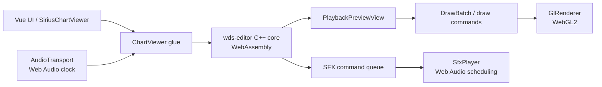

# Sirius Chart Viewer

<p align="center">
  
</p>

<p align="center">
  A browser-based 3D chart previewer for <em>World Dai Star</em>, powered by the
  <a href="https://github.com/TeamOpenSirius/wds-editor">wds-editor</a> preview core.
</p>

<p align="center">
  <a href="./README.md"><strong>English</strong></a> ·
  <a href="./README-CN.md">简体中文</a>
</p>

<p align="center">
  <a href="https://github.com/TeamOpenSirius/SiriusChartViewer/actions/workflows/build.yml"></a>
  
  
  
  
</p>

---

## Overview

**Sirius Chart Viewer** brings the chart preview experience of `wds-editor` to the browser.

Instead of reimplementing the renderer in JavaScript, the project compiles the upstream C++ preview core to **WebAssembly** with Emscripten and reproduces its rendering pipeline on top of **WebGL2**. Playback timing and hit sound scheduling are handled through the **Web Audio API**, while the standalone UI and embeddable component are built with **Vue 3 + TypeScript**.

The goal is to keep browser previews visually and behaviorally close to the desktop editor while remaining easy to deploy and embed into other web applications.

> This project is a **viewer only**. It does not provide chart editing functionality.

## Features

- **Browser-native chart preview** with no desktop application required.
- **Upstream preview-core reuse** from `wds-editor` through a Git submodule.
- Supports **`.wdschart`**, official **`.csv`**, and **`.sus`** charts.
- Optional music, jacket/cover image, and official `music_config.csv`.
- Rendering behavior designed to match the desktop preview, including:
  - stage and note rendering;
  - split lines and effects;
  - combo display;
  - judgment text;
  - hit-effect timing.
- Web Audio based playback clock and scheduled hit sounds.
- Playback rate control from **0.5× to 2×**.
- Adjustable note speed, lane cover/start offset, note thickness, split-line opacity, music volume, and SFX volume.
- Keyboard shortcuts, seeking, fullscreen support, and mobile-responsive controls.
- Can be built as:
  - a **standalone static web page**;
  - an **embeddable Vue component/library**.
- URL-based chart loading for integration with other services.

## Supported Inputs

| Input | Supported formats / behavior |
| --- | --- |
| Chart | `.wdschart`, official `.csv`, `.sus` |
| Music | Browser-decodable audio such as OGG, MP3, WAV, M4A/AAC, FLAC, Opus, WebM |
| Cover | PNG, JPEG, WebP, GIF, AVIF, BMP and other browser-decodable images |
| Timing config | Official `music_config.csv`, using `DelaySeconds` |

Audio and image codec support ultimately depends on the browser.

## Tech Stack

| Layer | Technology |
| --- | --- |
| UI | Vue 3, TypeScript |
| Web build | Vite |
| Preview core | C++17 from `wds-editor` |
| Native-to-web toolchain | Emscripten + CMake |
| Rendering | WebGL2 |
| Audio / timing | Web Audio API |
| CI | GitHub Actions |

## Quick Start

### Requirements

- **Node.js 20+**
- **Emscripten / emsdk**
- **CMake 3.20+**
- **Ninja** is recommended

Clone the repository **with submodules**:

```bash
git clone --recursive https://github.com/TeamOpenSirius/SiriusChartViewer.git
cd SiriusChartViewer

npm ci
npm run dev
```

If the repository was cloned without submodules:

```bash
git submodule update --init --recursive
```

The development command performs three steps:

1. synchronizes hit-sound assets from `wds-editor`;
2. compiles the C++ preview core to WebAssembly;
3. starts the Vite development server.

### Emscripten discovery

`scripts/build-wasm.mjs` searches for Emscripten in this order:

1. the `EMSDK` environment variable;
2. `emcc` available on `PATH`;
3. `C:/SDK/emsc/emsdk` on Windows.

To build a debug WASM version with verbose `WDS_LOG` output:

```bash
node scripts/build-wasm.mjs --debug
```

The debug build directory is `build/wasm-debug/`.

## Available Scripts

| Command | Description |
| --- | --- |
| `npm run dev` | Sync assets, build WASM, then start Vite |
| `npm run build` | Build the standalone site into `dist/` |
| `npm run preview` | Preview the production Vite build |
| `npm run typecheck` | Run Vue/TypeScript type checking |
| `npm run sync:assets` | Copy runtime hit-sound assets from the submodule |
| `npm run build:wasm` | Compile the native preview core into `public/wasm/` |
| `npm run build:lib` | Build the embeddable library into `dist-lib/` |

The standalone Vite build uses a relative base path, so `dist/` can be deployed under an arbitrary subdirectory.

## Using the Standalone Viewer

Open or drag files into the page. Multiple related files can be selected at once.

Typical inputs are:

```text
expert.csv
song.mp3
cover.jpg
music_config.csv
```

The page automatically separates chart, audio, cover, and timing configuration files.

### Keyboard Shortcuts

| Key | Action |
| --- | --- |
| `Space` | Play / pause |
| `←` / `→` | Seek backward / forward 5 seconds |
| `Shift + ←` / `Shift + →` | Seek backward / forward 1 second |
| `Home` | Return to chart start |
| `F` | Toggle fullscreen |
| Double-click stage | Toggle fullscreen |

On browsers without element fullscreen support, such as iOS Safari, the component falls back to filling the viewport.

### URL Parameters

The standalone page can load remote resources directly:

```text
index.html?chart=<chart-url>&music=<music-url>&cover=<cover-url>&config=<music_config-url>&name=<display-name>&t=<start-seconds>
```

| Parameter | Meaning |
| --- | --- |
| `chart` | Chart URL |
| `music` | Optional music URL |
| `cover` | Optional jacket/cover URL |
| `config` | Optional `music_config.csv` URL |
| `name` | Optional chart file name / display name |
| `t` | Optional initial playback position in seconds |

Remote resources must permit browser access through **CORS**.

## Embedding as a Vue Component

Build the library:

```bash
npm run build:lib
```

Output:

```text
dist-lib/
├── sirius-chart-viewer.js
├── sirius-chart-viewer.css
├── types/
└── assets/
    ├── wasm/
    │   ├── sirius-viewer.js
    │   ├── sirius-viewer.wasm
    │   └── sirius-viewer.data
    └── effects/
```

Vue is treated as a peer dependency. The runtime `assets/` directory must be hosted by the integrating application.

> The package is currently marked `private` in `package.json`; the documented workflow is to build `dist-lib/` from the repository rather than install it from npm.

### Example

```vue
<script setup lang="ts">
import { SiriusChartViewer } from 'sirius-chart-viewer'
import 'sirius-chart-viewer/style.css'
</script>

<template>
  <div style="height: 480px">
    <SiriusChartViewer
      :chart="chartBlob"
      chart-name="expert.csv"
      :music="'/api/song/audio'"
      :cover="'/api/song/cover'"
      asset-base="/sirius-chart-viewer/"
      autoplay
      @loaded="info => console.log(info)"
      @error="console.error"
    />
  </div>
</template>
```

The component fills its parent container, so the parent should provide an explicit height.

### Component Props

| Prop | Type / purpose |
| --- | --- |
| `chart` | `File`, `Blob`, `ArrayBuffer`, typed-array view, or URL string |
| `chart-name` | File name used to detect `.wdschart`, `.csv`, or `.sus`; optional when the source already has a name |
| `music` | Optional music source using the same source types |
| `music-config` | Optional official `music_config.csv` |
| `cover` | Optional jacket/cover image |
| `asset-base` | Base URL containing `wasm/` and `effects/`; defaults to `/sirius-chart-viewer/` |
| `autoplay` | Start playback after loading, subject to browser autoplay policy |
| `fetch-init` | Optional `fetch()` options for URL sources, such as authentication headers |

### Events

| Event | Payload |
| --- | --- |
| `ready` | None — preview engine initialized |
| `loaded` | `ChartInfo` containing note count and timing information |
| `error` | Error message string |
| `ended` | None — playback reached the end |

### Exposed Methods

Using a Vue template ref, the component exposes:

```ts
play()
pause()
toggle()
seek(seconds)
```

It also exposes the underlying `ChartViewer` instance for advanced integrations.

### Content Security Policy

If the host page uses CSP, WebAssembly execution generally requires:

```text
script-src 'wasm-unsafe-eval'
```

Adjust the full policy according to the host application's own security requirements.

## Architecture



At runtime, the audible music clock drives the preview timeline. The WebAssembly side applies the chart timeline and produces rendering commands plus SFX events. JavaScript then renders those commands through WebGL2 and schedules hit sounds against the Web Audio clock.

This split allows the project to reuse the mature upstream chart/preview logic without carrying the desktop editor's Vulkan, BASS, or UI dependencies into the browser.

## Project Structure

| Path | Purpose |
| --- | --- |
| `third_party/wds-editor/` | Upstream editor Git submodule; kept unmodified |
| `native/CMakeLists.txt` | Builds selected upstream C++ sources with Emscripten |
| `native/shim/` | Browser-side replacement headers for desktop-only dependencies |
| `native/src/viewer.cpp` | Exposes the `wv_*` bridge API used by JavaScript |
| `native/src/web_renderer.cpp` | Web implementation of the renderer command path |
| `native/src/split_colors.cpp` | Split-line color logic adapted from upstream editor code |
| `src/lib/viewer.ts` | High-level glue between WASM, WebGL2, and Web Audio |
| `src/lib/glRenderer.ts` | WebGL2 rendering backend |
| `src/lib/audioTransport.ts` | Playback clock and music transport |
| `src/lib/sfx.ts` | Hit-sound scheduling |
| `src/components/SiriusChartViewer.vue` | Embeddable player component |
| `src/App.vue` | Standalone viewer application |
| `scripts/` | WASM build, asset sync, and library packaging scripts |

The skin PNG files from `wds-editor` are embedded into `sirius-viewer.data` during the Emscripten build. Hit-sound assets are copied separately into `public/effects/`.

## Following Upstream `wds-editor`

The project intentionally reuses upstream source files rather than maintaining a forked copy.

To update the submodule:

```bash
git -C third_party/wds-editor pull origin main
npm run build:wasm
```

If compilation breaks after an upstream update, the most likely cause is an API change around `PlaybackPreviewView` or another reused renderer interface. Update the compatibility code under `native/shim/` or the small web-specific bridge implementations as needed.

## Browser Requirements

A modern browser with the following features is required:

- WebAssembly;
- WebGL2;
- Web Audio API;
- ES modules.

Recent Chromium, Firefox, and Safari releases are the intended targets. Actual audio codec support varies by browser and operating system.

## Known Differences / Limitations

- Hold-body SFX gating is updated per frame (roughly 16 ms) rather than reproducing the exact BASS hold-gate edge behavior from the desktop editor.
- `.wdsproject` is not supported because it represents a multi-file project; load its chart and music files directly instead.
- This project is a **previewer**, not an editor.
- Hit SFX assets are OGG. Older Safari versions without Ogg Vorbis support will not play hit sounds, although music playback may still work with supported codecs.
- Browser autoplay policies may block `autoplay` until the user interacts with the page.

## CI

GitHub Actions builds the project on pushes to `main`, version tags, and pull requests. The workflow builds both:

- `dist/` — standalone site;
- `dist-lib/` — embeddable component package.

Both directories are uploaded as workflow artifacts.

## Contributing

Issues and pull requests are welcome.

For changes touching the preview core integration, prefer keeping `third_party/wds-editor` unmodified and implementing browser-specific compatibility in `native/shim/` or `native/src/`. This keeps upstream updates easier to track.

## License

The source code in this repository is licensed under **GNU GPL v3 only (GPL-3.0-only)**. See [LICENSE](./LICENSE).

`wds-editor` is included as a Git submodule and is governed by its own repository and licensing terms.

## Disclaimer

This is an unofficial community project. *World Dai Star* and related names, game content, artwork, audio, and other assets belong to their respective rights holders. This project is not affiliated with or endorsed by the official game operators or publishers.
